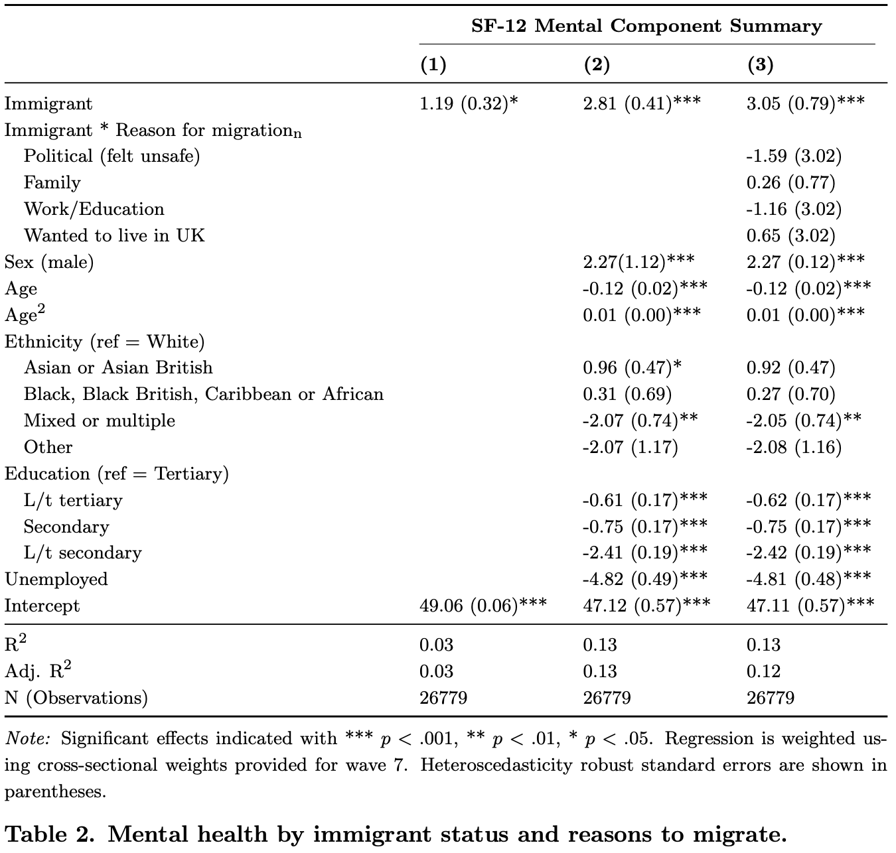
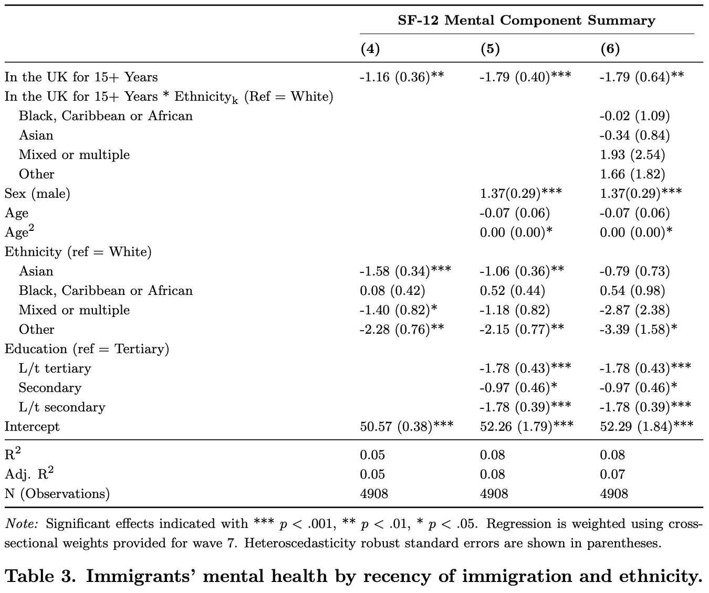

# Unpacking mental health disparities among immigrant and domestic-born populations in the UK

This repository contains the code and analysis for a study investigating mental health disparities between immigrant and UK-born populations, and across immigrant sub-groups in the United Kingdom. 

## Full Paper
For a complete discussion of the literature, methods, results, and implications, please refer to the [full paper](/AAS-ImmigrantMH.pdf) in this repository.

## Abstract
This study uses wave 7 of the UK Household Longitudinal Study to investigate mental health disparities between immigrant and UK-born populations, and across immigrant sub-groups. In turn, it assesses the “healthy immigrant effect” – tendency of recent immigrants to be healthier than the native-born – and the hypothesised subsequent process of unhealthy assimilation. Results from linear regressions used in this cross-sectional design reveal that recent immigrants do exhibit a mental health advantage over UK natives, which diminishes significantly for those who have lived in the UK for over 15 years. This study also addresses knowledge gaps left in the literature by the frequent aggregation of all immigrants into a single unit of analysis. I find no significant mental health disparities between immigrants with varying migration reasons, nor do I observe di↵erences in mental health decline across distinct ethnic groups.

## Hypotheses

### Healthy Immigrant Effect

**Model:** $MH_i = \alpha + \beta_1 Immigrant_i + \sum \gamma_n (Immigrant_i \cdot Reason_{n,i}) + \mu X_i + \epsilon_i$

Where:
- $MH_i$ is the mental health score for individual $i$
- $Immigrant_i$ is a dummy variable for being an immigrant
- $Immigrant_i \cdot Reason_{n,i}$ represents the interaction between immigrant status and migration reasons
- $X_i$ is the vector of control variables (age, ethnicity, unemployment, education)
- $\mu$ is the vector of corresponding coefficients
- $\epsilon_i$ is the error term

The “healthy immigrant effect” (HIE) refers to the observation that immigrants often dis- play better health outcomes, both physical and mental, than the native-born populations of their destination country (Kennedy et al., 2015; McDonald & Kennedy, 2004). This is likely due to selection on good health (*selectivity hypothesis*), favourable health behaviours (*cultural hypothesis*), and the tendency of less healthy immigrants to return to their birth country (*salmon bias*).

**H1:** Immigrants exhibit better mental health than UK-born individuals (HIE).

I add a nuance: compared to a voluntary immigrant, a refugee will have had more chances to be exposed to intense stressors, such as trauma or bad hygiene in camps, which deterio- rate mental health (van de Wiel et al., 2021). The Understanding Society survey unfortunately does not contain data on refugees, but it includes immigrants’ reasons for migrating. This variable can act as a proxy for the voluntary/refugee divide because it captures key elements of migration context that influence exposure to stressors.

**H2:** Immigrants who migrated because they did not feel safe in their country of birth have worse mental health than those who moved for education or work.

### Unhealthy Assimilation Effect

**Model:** $MH_i = \alpha + \beta_1 Non\text{-}Recent_i + \sum_{k+1} Ethnicity_{k,i} + \sum_k (Non\text{-}Recent_i \cdot Ethnicity_{k,i}) + \mu X_i + \epsilon_i$

- $Non\text{-}Recent_i$ indicates the immigrant has lived in the UK for more than 15 years
- $\beta_1 Non\text{-}Recent_i$ represents the effect of extended residency on mental health
- $\sum_{k+1} Ethnicity_{k,i}$ represents the main effects of ethnicity
- $\sum_k (Non\text{-}Recent_i \cdot Ethnicity_{k,i})$ represents the interaction between extended residency and ethnicity

The literature has reached a consensus that the healthy immigrant e↵ect deteriorates as immigrants assimilate, in Europe (Bousmah et al., 2019) and the North America (Antecol & Bedard, 2006; Kwak, 2018). This “unhealthy assimilation” is usually explained by processes including the adoption of unhealthy habits, acculturation stress, discrimination, and poor economic and social conditions (Ferrara et al., 2024).

**H3:** Non-recent immigrants display lower mental health levels than recent migrants.

In the UK, many stressors disproportionately impact people from minority ethnic backgrounds.

**H4:** The deterioration in mental health between recent and non-recent immigrants is stronger for those from minority ethnic backgrounds than for White immigrants.

## Key Findings

### Healthy Immigrant Effect

Recent immigrants (≤15 years in UK) exhibit significantly better mental health than UK-born individuals (+2.8 points on the normalized 0-100 scale), supporting the healthy immigrant effect hypothesis.

No significant differences in mental health were found among immigrants with varying migration reasons. Whether immigrants moved for work/education, family reasons, political safety, or simply wanting to live in the UK did not significantly impact their mental health upon arrival.

### Unhealthy Assimilation Effect

Immigrants who have lived in the UK for over 15 years display significantly lower mental health scores than recent immigrants, supporting the unhealthy assimilation hypothesis. This finding is robust across different thresholds for defining "recent" immigrants (from 10 to 25 years).

However, the study found no evidence that unhealthy assimilation varies by ethnicity. The mental health decline associated with longer UK residence was consistent across ethnic groups.

## Implications

The results of this study challenge (implicit) assumptions regarding immigrants’ health outcomes, which have led researchers to view their observed advantages as ‘paradoxical’. Most importantly, they highlight the need to tackle the well-documented challenges that restrict immigrants’ access to mental healthcare, including discrimination, language barriers, and insuffcient cultural sensitivity training for healthcare professionals (Ferrara et al., 2024).
